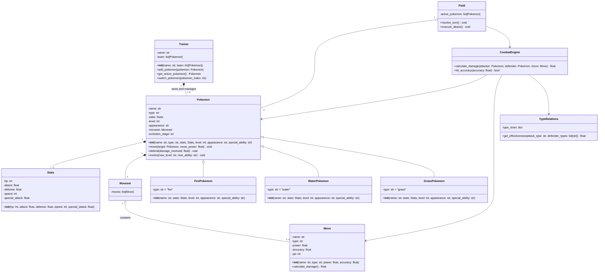

# POKE

# Sistema de combate Pokémon (POKE)

## Tabla de contenidos

- [Objetivos](#objetivos)
- [Contextualización](#contextualización)
- [Diseño del sistema](#diseño-del-sistema)
  - [Sistema de combate](#sistema-de-combate)
  - [Gestión de equipos](#gestión-de-equipos)
  - [Entorno de batalla](#entorno-de-batalla)
- [Acciones del Pokemon](#acciones-del-pokemon)
  - [move](#movetarget-pokemon-move_power-float-void)
  - [defend](#defenddamage_received-float-void)
  - [evolve](#evolvenew_level-int-new_ability-str-void)
- [Constructor de la clase Pokemon](#constructor-de-la-clase-pokemon)
- [Diagrama UML](#diagrama-uml)
 

## Objetivos 
1. Modelar un sistema de combate tipo Pokémon usando los términos de Programación Orientada a Objetos aprendidos en clase
2. Definir las clases principales del sistema
3. Diseñar relaciones entre entidades mediante UML
4. Definir atributos y métodos coherentes dentro del modelo
---

## Contextualización

Para dar un buen inicio, es necesario comprender cómo se puede utilizar el concepto de Pokémon y por qué puede abstraerse y relacionarse con la Programación Orientada a Objetos.

Basándonos en la franquicia y en la lógica de los combates de los videojuegos, es posible modelar un sistema donde diferentes entidades interactúan entre sí mediante responsabilidades bien definidas. Esto permite representar mecánicas como combates, efectividad de tipos y gestión de equipos a través de clases, atributos y métodos.

---

## Diseño del sistema

A partir de lo descrito, y basándonos en la franquicia y videojuegos de Pokémon, se propone como parte del diseño la entidad *Pokemon*, integrada dentro de un sistema más amplio, y abstraída con atributos generales como:

- ***Puntos de vida (HP)***: Al ser una entidad viva capacitada para combatir, se utilizan como parámetro de control, el cual cambiará constantemente durante un combate.  
- ***Tipo***: Atributo general que define cómo interactuará un Pokémon en el entorno, determinando sus fortalezas y debilidades frente a otros tipos.  
- ***Nombre***: Identificador único y legible para cada Pokémon.  
- ***Aspecto***: Característica que permite describir visualmente al Pokémon.  
- ***Nivel***: Atributo que influye en el rendimiento general y puede modificarse mediante evolución.  
- ***Habilidad especial***: Capacidad única que puede alterar el comportamiento del Pokémon durante el combate.  
- ***Estadísticas (Stats)***: Conjunto de atributos encapsulados en un objeto que incluye puntos de vida, ataque, defensa, velocidad y ataque especial.  
- ***Movimientos (Moveset)***: Conjunto de acciones que el Pokémon puede ejecutar en combate, limitado a un máximo de cuatro movimientos.  
- ***Etapa de evolución***: Permite rastrear el desarrollo del Pokémon y su progreso dentro del sistema.  

---

### Sistema de combate

- **CombatEngine**: Calcula el daño y determina si un ataque acierta o falla.  
- **TypeRelations**: Define la efectividad entre tipos de Pokémon.  

---

### Gestión de equipos

- **Trainer**: Gestiona un equipo de hasta 6 Pokémon.  
  Permite agregar, seleccionar y cambiar Pokémon durante el combate.  

---

### Entorno de batalla

- **Field**: Controla el combate entre dos Pokémon activos.  
  Gestiona turnos, orden de ataque y ejecución de acciones.  

---

## Acciones del Pokemon

### ***move(target: Pokemon, move_power: float): void***

Acción fundamental para la interacción entre objetos. Permite ejecutar un ataque sobre otro Pokémon, aplicando daño en función del poder del movimiento.

**Parámetros:**
- `target (Pokemon)`: Pokémon que recibirá el ataque  
- `move_power (float)`: Poder base del ataque utilizado  

---

### ***defend(damage_received: float): void***

Permite al Pokémon reducir el daño recibido utilizando sus estadísticas defensivas.

**Parámetros:**
- `damage_received (float)`: Cantidad de daño antes de aplicar la defensa  

---

### ***evolve(new_level: int): void***

Permite al Pokémon aumentar su nivel y evolucionar.

**Parámetros:**
- `new_level (int)`  

---

## Constructor de la clase Pokemon

```python
__init__(
  name: str,
  type: str,
  stats: Stats,
  level: int,
  appearance: str,
  moveset: Moveset,
  special_ability: str
)
```

---

## Diagrama UML

Aunque el sistema puede ampliarse con más características, los componentes descritos representan la estructura fundamental necesaria para modelar un sistema de combate tipo Pokémon utilizando los principios de Programación Orientada a Objetos aprendidos durante las clases.
