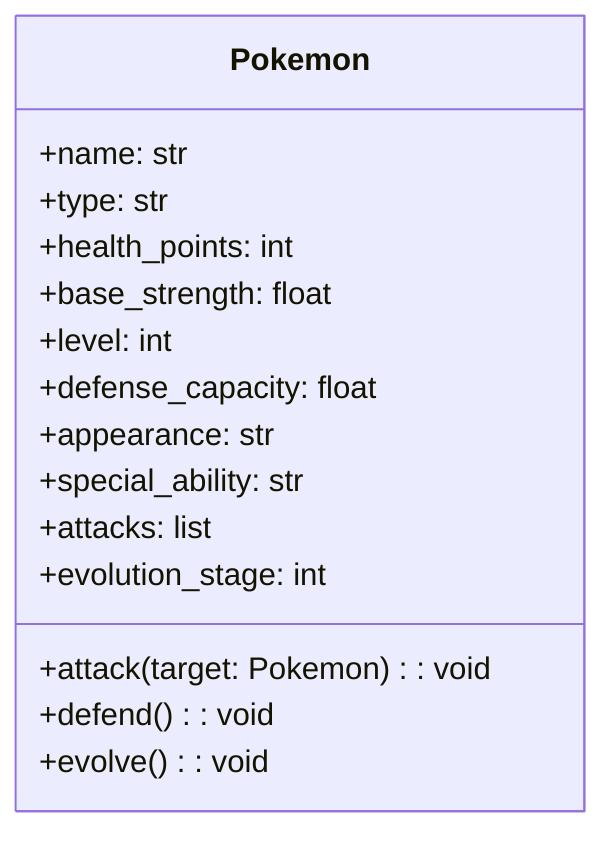

## Proyecto de curso POO-2026-1

# POKE

# Resolución Actividad 1 y 2: Clase Pokemon  📚
## Objetivos 📌
1. Desarrollar la clase Pokemon.
2. Definir 10 características que posee la clase Pokemon.
3. Definir 3 Acciones que puede realizar la clase Pokemon.
4. Proponer su estructura constructor.
5. Elaborar un diagrama tipo UML inicial de la clase.
6. Los atributos tengan sentido dentro del modelo.
7. Los métodos sean realistas e implementables.

> Cómo cumplimiento de los objetivos se hace entrega del presente documento, donde se trazó todo el curso y puesta en marcha del procedimiento. 
---

## Tabla de contenidos
- [Contextualización](#contextualizacion)
- [Diseño de clase](#diseño-de-clase)
- [Diagrama UML](#diagrama-uml)


## Contextualizacion

Para dar un buen inicio, se debe comprender el cómo se usaría la teoría de Pokémon y por qué este es un buen método para el aprendizaje de la Programación Orientada a objetos.

#### ¿Porqué POO en Pokemon? 🤔

La programación orientada a objetos se basa en la modelación dinámica de desarrollo de procesos cómo evolución de la programación estructurada, 
es decir, nos da la posiblidad de realizar un proceso más eficiente, reflejando e interpretando fielmente el mundo real. 

Nos facilita la comprensión y el modelado de entidades del mundo real en la codificación de estas en el mundo virtual, esto a traves de clases cómo plantillas formadoras de objetos, abstrayendo la esencia de una entidad a partir de atributos que la caracterizan y las acciones que puede realizar.

**Pokemon** Es una franquicia iniciada cómo un videojuego RPG, donde en un mundo alternativo los humanos conviven con criaturas ficticias, capturándolas, entrenándolas y utilizándolas para combatir entre sí.

A partir de esto, logramos ver que pokemon funciona con reglas lógicas y relaciones que encajan muy bien en los pilares fundamentales de la **POO**:

- Abstracción: Al ser pokemon un mundo alternativo imaginario, logramos abstraer la esencia de este, que son los pokemones, y logramos identificarlos bajo sus atributos relevantes y las acciones que logran hacer.
  
- Herencia: Podemos observar que todos los pokemones comparten rasgos, pero a sus vez tienen especializaciones que los diferencian a cada uno, por lo tanto somos capaces de a partir una *Clase* general, generar otra que **herede** de está sus características y que forme otras nuevas que la especializen.

- Polimorfismo: A su vez aquellas herencias de la clase padre pueden cambiar, pues todos los pokemones son capaces de *atacar()* más todos atacan distinto.

- Encapsulamiento: Finalmente, varias de las características que poseen los pokemones no se pueden cambiar si no a partir de procesos, y no todos pueden cambiarla, por lo tanto estas deben tener características protegidas, privadas o públicas para modificarlas dependientemente.

En sintesís, Pokemon es capaz de abstraer criaturas ficticias y relacionarlas entre sí basandose en sus clases especificas heredadas de su identidad común, evolucionar y comportarse de módo diferente con respecto a una condición, lo cual aporta significativamente a una comprensión de lo que es La poo
puesto que está se basa en simbolizar objetos generales y llevar a cabo procesos especializados entre sus individualidades.

## Diseño de clase 

A partir de lo descrito, Basándonos en la franquicia y videojuegos de pokemon, se propone cómo clase principal para nuestro diseño la entidad *POKEMON*, abstraida con atributos generales cómo: 

- *Puntos de vida* : Al ser una entidad viva capacitada para combatir, nos basamos en los puntos de vida cómo parametro de control, el cuál cambiara su valor constantemente durante un combate.
- *Tipo* : Atributo general que define los diversos caminos de cómo interactuará un pokemon en el entorno.
- *Nombre*: Puesto que todo objeto necesita un identificador legible para el usuario y diferenciable de todo pokemon.
- *Aspecto* : Característica que permite visualizar con mayor detalle a cada objeto.
- *Fuerza base:*: Capacidad de influencia a otro objeto pokemon, que toda instanciación debera tener.
- *Nivel* : Atributo pivote, capaz de moderar los atributos generales del pokemon, modificable a partir de una acción de mejora que posea el pokemon.
- *Capacidad de defensa* : Al igual que el pokemon es capaz de influir a otro, este tambien es condicionado contra otro objeto, por lo que el atributo *capacidad de defensa* logra controlar más la interacción de combate entre pokemones.
- *Habilidad especial* : Como medio de ataque el pokémon poseerá una habilidad individual que altere la fuerza y resistencia del pokemon, generando mayor diversidad y campo de juego en las relaciones.
- *Ataques*  : Acciones consecutivas en el campo de batalla, cada una poseerá una característica especial, aumentando la variabilidad de sus estadísticas.
- *Evolución* : Medida importante que rastrea el desarrollo del objeto, capaz de modificar su atributo *Nivel* a partir de una acción controlada.

Finalmente, aunque muchas características sean bienvenidas, se consideran cómo las fundamentales y generales para la relación de un pokemon en el mundo virtual.

Por otro lado, a partir de estás características, el pokemon se comportará en un ambiente de combate con acciones que todos los objetos poseen:

- ***Atacar()***: Acción fundamental para la interacción entre objetos, afecta principalmente el atributo de *Puntos de vida*.
- ***Defender()*** : Capacidad que contraresta parcialmente un ataque, cuál podrá recurrir en su turno de juego.
- ***Evolucionar()*** : Acción modificadora de las estadísticas que afectan el desempeño del pokemon, abre la puerta a la interacción entre el pokemon y su propietario o entrenador, quien será el que manipule al pokemon, según el contexto.

---

### Sintesis
Proponemos la siguiente clase *Pokemon* que afianza la interpretación de un Pokemon con las características que todos estos tienen, capaces de interactuar y afectarse entre ellos, por lo que se propone la estructura de la construcción de la plantilla de la siguiente manera.

#### constructor de clase pokemon
 Parametros  de entrada:
 - Vida: default = 10 
 - ataque : default = 1
 - defensea : default = 0.5
 - Nivel: default = 1
 - tipo: variable, asignable por el entorno
 - aspecto: variable, asignable por el retorno
 - habilidd especial : variable, default = ninguno

de forma que una sintaxis correcta seria: 

```bash
- CONSTRUCTOR(vida, ataque, defensa ,nivel, tipo , aspecto, habilidad especial):
   asignación atributos con parametros
```

--- 

## Diagrama UML

Se utiliza los tres metodos principales de ataque, defensa y evolucionar, con sus respectivos atributos para controlar el comportamiento del pokemon en el entorno de combate, además de los atributos generales que caracterizan a cada pokemon.

Siendo valido que se puedan usar estos metodos, aunque en el futuro se puedan agregar más, pero estos son los generales para la interacción entre pokemones.
